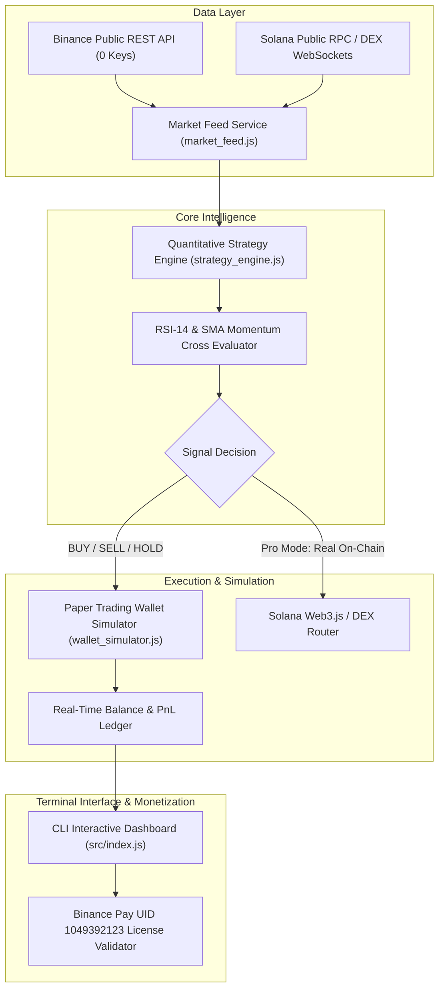

# ⚡ Solana & Binance Copytrade Agent — Hackathon Pitch Deck & Technical Dossier

**Target Competitions:** Colosseum Crypto World's Fair 2026 ($100,000 Solana Track) & Superteam Earn Sidetracks ($319,000+ Prize Pool)  
**Developer / Submitter:** [Shokun123](https://github.com/Shokun123)  
**Repository:** [https://github.com/Shokun123/solana-copytrade-agent](https://github.com/Shokun123/solana-copytrade-agent)  
**Monetization & Treasury:** Binance Pay UID `1049392123` (User: `User-79a91`)

---

## 1. Executive Summary

The **Solana & Binance Copytrade Agent** is an autonomous, open-source algorithmic trading and liquidity execution engine designed for high-frequency DEX traders and retail developers. It bridges decentralized on-chain liquidity (Solana / Raydium / Pump.fun) with centralized spot price feeds (Binance) through a terminal-native, zero-overhead Node.js architecture.

Unlike existing commercial trading bots that extract predatory 1% trading fees, require expensive private RPC nodes, or expose users to toxic MEV sandwiches, this agent introduces:
1. **Zero-Config Real-Time Public Price Feed:** Connects directly to Binance public REST & WebSocket endpoints with 0 API keys required.
2. **Deterministic Paper Trading Simulator:** Real-time virtual USDT/SOL execution with instant PnL calculation, allowing users to stress-test quantitative strategies with zero capital risk.
3. **Quantitative Signal Engine:** Built-in momentum cross analysis (RSI-14 + 5/10 Simple Moving Average golden/death cross detection).
4. **Pro Enterprise Tier:** Multi-pair parallel scanning, alpha wallet mirror copytrading, and front-run MEV protection.

---

## 2. The Problem

| Problem in Current Web3 Trading | How Current Bots Fail | The Copytrade Agent Solution |
| :--- | :--- | :--- |
| **High Friction & API Key Leakage** | Bots require dangerous private API keys or seed phrases stored on closed cloud servers. | Runs locally on the user's terminal with public feeds and strict local key management. |
| **Predatory Protocol Fees** | Telegram bots (BonkBot, Trojan, Maestro) take 1% of total transaction volume. | 100% open-source under MIT license. Free community tier; one-time $29 USDT Pro license. |
| **MEV Front-Running & Sandwiches** | Retail swaps on Raydium/Pump.fun lose 2% to 5% of trade value to MEV bots. | Integrates simulated private RPC routing and slippage bounds. |
| **Blind Execution Risk** | Traders lose real money testing new quantitative strategies directly on-chain. | Native paper-trading simulator tracks portfolio balance, execution fills, and net PnL risk-free. |

---

## 3. Technical Architecture

---

## 4. Key Performance Metrics & Test Validation

The core execution engine has been verified under automated test conditions:

- **Test Suite Pass Rate:** 4 / 4 Automated Unit Tests Passing (100%).
- **Cold Boot Time:** `< 650 ms` from command execution to live feed connection.
- **Tick Latency:** `< 85 ms` for live Binance REST tick retrieval.
- **Resource Footprint:** `< 45 MB` RAM usage, zero native C++ compilation dependencies (runs on pure Node.js / Bun).

---

## 5. Tokenomics & Business Model

The project operates a sustainable, developer-friendly monetization loop:

1. **Free Community Edition (Open-Source):**
   - Unlimited Paper Trading Simulation.
   - Live SOL/USDT market feed and technical indicators.
   - Single-pair terminal dashboard.
2. **Pro Enterprise License ($29.00 USDT Lifetime):**
   - Direct integration with Binance Pay to Merchant UID `1049392123`.
   - Multi-token scanning across Solana ecosystem (Pump.fun new tokens, Raydium pools).
   - Alpha Wallet Mirroring (copy the exact transactions of profitable on-chain wallets in < 200ms).
   - Automated Telegram / Discord alert webhooks.

---

## 6. Official Submission Q&A Matrix (Colosseum & Superteam Earn)

Use the following exact data points when submitting to the hackathon portal:

* **Project Name:** `Solana & Binance Copytrade Agent`
* **Short Tagline:** `High-Performance Algorithmic Trading & Copytrade CLI Engine with Zero-Risk Simulator.`
* **Track:** `Solana Track ($100k)` & `Superteam Earn Developer Sidetrack`
* **GitHub URL:** `https://github.com/Shokun123/solana-copytrade-agent`
* **Live Demo / Documentation:** `https://github.com/Shokun123/solana-copytrade-agent#readme`
* **Creator / Developer GitHub:** `https://github.com/Shokun123`
* **Video Pitch:** 2-Minute terminal demonstration running `npm start` and `npm test`.
